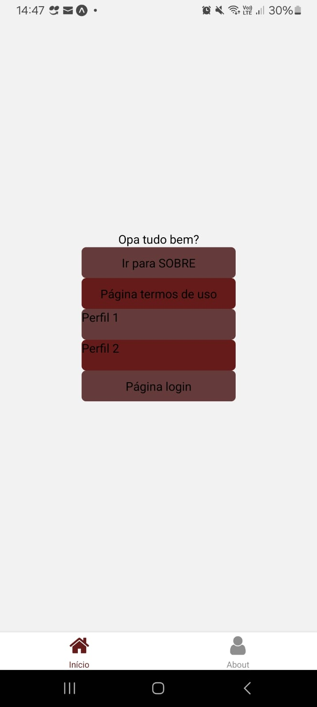

<p align="center">
  
</p>
<h1 align="center"> Clone NuBank</h1>

<p align="center">Este projeto foi desenvolvido para praticar e consolidar os conhecimentos em React Native,desenvolver um projeto conceito com base no app NuBank.</p>

<br>
🚀 Desenvolvedora:
<a href="https://www.tayserosa.com">
Tayse Rosa
</a>
<br>
🟡 Status do projeto: Iniciando..

---
<p align="center">
  
</p>


## 🚀 Tecnologias Utilizadas
<ul>
    <li>React Native</li>
    <li>Expo</li>
    <li>Typescript</li>
    <li>NativeWind </li>
</ul>


## 🚀 Para você rodar o projeto
```
Digite no prompt de comando: git clone https://github.com/TayseRosa/nubank.git
cd <nome da pasta do projeto>
npm install
npx expo start
```

## 🚀 Anotações importantes


## Licença
Esse projeto está sob a licença MIT. Veja o arquivo [LICENSE](LICENSE.md) para mais detalhes.


## 📫 Contribuindo para Projeto

Para contribuir com Projeto, siga estas etapas:

1. Bifurque este repositório.
2. Crie um branch: `git checkout -b <nome_branch>`.
3. Faça suas alterações e confirme-as: `git commit -m '<mensagem_commit>'`
4. Envie para o branch original: `git push origin <nome_do_projeto> / <local>`
5. Crie a solicitação de pull.

Como alternativa, consulte a documentação do GitHub em [como criar uma solicitação pull](https://help.github.com/en/github/collaborating-with-issues-and-pull-requests/creating-a-pull-request).


<a href="https://www.tayserosa.com">
<p align="center">Feito com 💜 por Tayse Rosa</p>
</a>